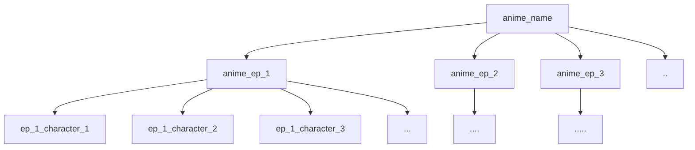

Example

```mermaid
graph TD;
    anime_name --> anime_ep_1;
    anime_name --> anime_ep_2;
    anime_name --> anime_ep_3;
    anime_name --> ..
    anime_ep_1 --> ep_1_character_1;
    anime_ep_1 --> ep_1_character_2;
    anime_ep_1 --> ep_1_character_3;
    anime_ep_1 --> ...;
    anime_ep_2 --> ....;
    anime_ep_3 --> .....;
```